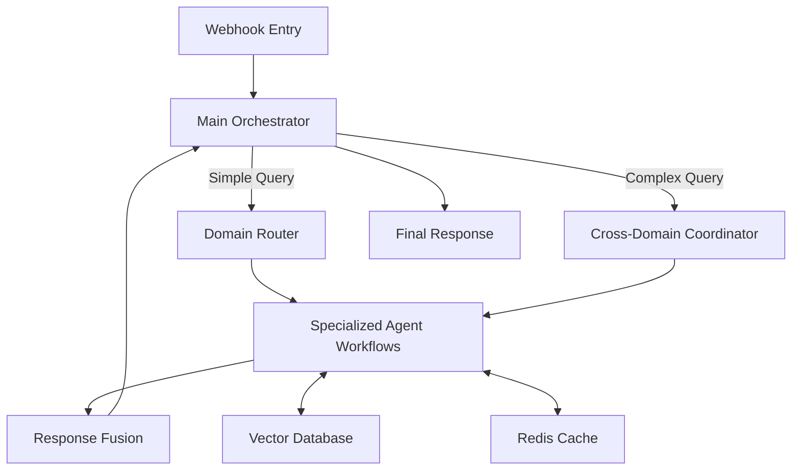
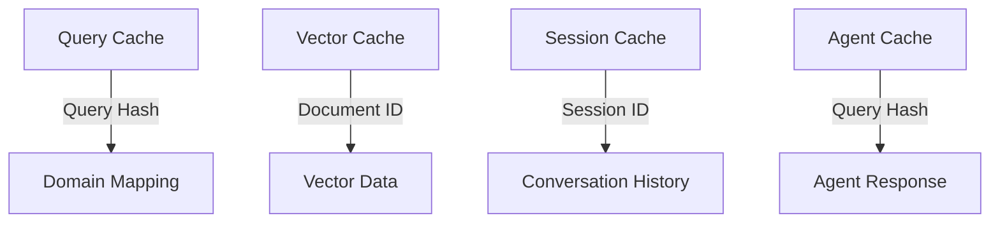

# Multi-Agent RAG System Implementation Documentation

## Table of Contents
1. [System Architecture](#system-architecture)
2. [Workflow Design](#workflow-design)
3. [Redis Caching Strategy](#redis-caching-strategy)
4. [Performance Optimization](#performance-optimization)
5. [Implementation Steps](#implementation-steps)
6. [Monitoring & Maintenance](#monitoring--maintenance)

## System Architecture

### Overview
The multi-agent RAG system is implemented entirely within n8n, leveraging Redis for caching and performance optimization. The architecture consists of:

## Workflow Design

### Main Orchestrator Workflow
1. Receives user query via webhook
2. Analyzes query complexity
3. Routes to Domain Router or Cross-Domain Coordinator
4. Receives and formats final response

### Domain Router Workflow
1. Classifies query domain
2. Routes to appropriate specialized agent
3. Handles fallback logic for ambiguous queries

### Specialized Agent Workflows
1. Perform domain-specific knowledge retrieval
2. Generate domain-specific responses
3. Implement caching strategies
4. Handle error cases gracefully

### Cross-Domain Coordinator
1. Decomposes complex queries into sub-queries
2. Coordinates parallel agent execution
3. Merges and ranks agent responses

### Response Fusion
1. Deduplicates information
2. Ranks content relevance
3. Generates final consolidated response

## Redis Caching Strategy

### Cache Structure

### Cache Implementation
1. **Query Cache**: Stores query-to-domain mappings
2. **Vector Cache**: Caches vector search results
3. **Session Cache**: Maintains conversation context
4. **Agent Cache**: Stores pre-computed agent responses

### Cache Management
- Set appropriate TTLs based on data volatility
- Implement cache invalidation on knowledge updates
- Use Redis Sets for session history with LRU eviction
- Monitor cache hit rates for optimization

## Performance Optimization

### Key Strategies
1. **Parallel Processing**: Use ExecuteBatch nodes for parallel agent execution
2. **Memory Management**: Minimize workflow data payloads
3. **Efficient Retrieval**: Implement context-aware document retrieval
4. **Caching**: Strategic Redis caching throughout workflows
5. **Error Handling**: Implement robust error handling and fallback mechanisms

### Optimization Techniques
- Use Function nodes for memory-efficient processing
- Implement chunked processing for large datasets
- Use early exit patterns to avoid unnecessary processing
- Optimize HTTP requests with connection pooling
- Use binary mode for large data transfers

## Implementation Steps

### Phase 1: Finance Agent Prototype (2-3 weeks)
1. **Notion Documentation Integration**
   - [x] Set up Notion API integration for Finance team docs
   - [/] Implement parsing and chunking of finance documentation
   - Extract tone of voice guidelines from documentation
   - [/] Configure vector embeddings and indexing with metadata

2. **Standalone Finance Agent Development**
   - Set up Redis instance for caching
   - Create n8n workflow with dedicated webhook endpoint
   - Implement context-aware retrieval from vector database
   - Develop response generation with finance-specific tone

3. **Specialized Features & Testing**
   - Add finance-specific terminology handling
   - Implement query caching and vector result caching
   - Create test suite with common finance queries
   - Test edge cases and optimize for finance-specific requirements

4. **Prototype Deployment & Documentation**
   - Configure standalone deployment for testing
   - Document agent workflow architecture
   - Prepare performance metrics and benchmarks
   - Establish update procedure for finance documentation changes

### Phase 2: Multi-Agent Framework Expansion (2 weeks)
1. Use Finance agent learnings to design Main Orchestrator workflow
2. Develop Domain Router with classification (including Finance domain)
3. Adapt Finance agent for integration with multi-agent system
4. Create prototype for 1-2 additional domain agents
5. Implement basic Response Fusion with Finance agent integration

### Phase 3: Complete System (2-3 weeks)
1. Develop remaining specialized agent workflows
2. Implement Cross-Domain Coordinator
3. Enhance Response Fusion with advanced ranking
4. Add comprehensive error handling and logging
5. Implement performance monitoring for all agents

## Monitoring & Maintenance

### Monitoring Setup
1. Add timing nodes to key workflows
2. Track cache hit rates
3. Monitor query latency
4. Implement error rate tracking
5. Set up alerting for performance thresholds

### Maintenance Procedures
1. Regular cache optimization
2. Workflow performance tuning
3. Knowledge base updates
4. Agent prompt refinement
5. System health checks

## Documentation Structure

### Workflow Documentation
Each workflow should include:
1. Purpose and functionality
2. Input/output specifications
3. Error handling procedures
4. Performance considerations
5. Maintenance requirements

### API Documentation
Document all webhook endpoints with:
1. Endpoint URLs
2. Request/response formats
3. Authentication requirements
4. Rate limiting information
5. Error codes and handling

### Operational Documentation
Include:
1. System architecture diagrams
2. Deployment procedures
3. Monitoring setup
4. Troubleshooting guide
5. Performance optimization tips

## Next Steps
1. Review and finalize this documentation
2. Begin Phase 1 implementation
3. Set up monitoring infrastructure
4. Establish documentation maintenance process
5. Plan for iterative improvements
