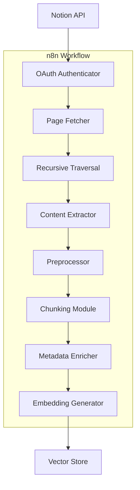

# Notion Document Ingestion Strategy for Contextual Retrieval RAG

## Overview
This document outlines the optimal approach for ingesting Finance team documentation from Notion into a contextual retrieval-based RAG system. The strategy focuses on preserving document structure, maintaining currency, and ensuring efficient retrieval of finance-specific information.

## Architecture

## Key Components

### 1. Notion API Connection
- OAuth integration with token refresh mechanism
- Rate limit handling and error management
- Efficient polling and webhook integration

### 2. Content Extraction & Structure Preservation
- Recursive parsing of Notion blocks
- Hierarchical structure preservation
- Special content type handling:
  - Tables
  - Code blocks
  - Lists
  - Toggle blocks
  - Databases

### 3. Intelligent Chunking Strategies
1. **Hierarchical Chunking**
   - Page-level
   - Section-level
   - Paragraph-level
   - Sentence-level

2. **Semantic Chunking**
   - Natural semantic boundaries
   - Related content grouping
   - Coherent meaning preservation

3. **Overlapping Windows**
   - Sliding window approach
   - 10-20% overlap
   - Dynamic adjustment based on complexity

### 4. Metadata Enrichment
- Document hierarchy
- Content classification
- Temporal information
- Finance-specific metadata

### 5. Embedding and Indexing
1. **Embedding Strategy**
   - Domain-adapted embeddings
   - Fine-tuning for finance terminology
   - Multiple embeddings per chunk

2. **Vector Store Implementation**
   - Metadata filtering
   - Hybrid search
   - Sparse-dense retrieval

3. **Retrieval Enhancement**
   - Re-ranking
   - Metadata boosting
   - Query expansion

### 6. Synchronization and Currency
1. **Change Detection**
   - Polling and webhook integration
   - Last_edited_time tracking
   - Efficient update detection

2. **Incremental Updates**
   - Changed document processing
   - Reindexing affected chunks
   - Version history maintenance

3. **Consistency Checks**
   - Document integrity validation
   - Cross-reference verification
   - Critical information preservation

### 7. n8n Implementation Considerations
1. **Workflow Structure**
   - Modular design
   - Error handling and retries
   - Queue-based processing

2. **Memory Management**
   - Batch processing
   - Streaming for large documents
   - Checkpointing

3. **Performance Optimization**
   - API response caching
   - Parallel processing
   - Incremental processing

### 8. Finance-Specific Considerations
1. **Tone of Voice Extraction**
   - Tone guideline extraction
   - Tone classification
   - Prompt template development

2. **Terminology Handling**
   - Finance term extraction
   - Glossary creation
   - Entity recognition

## Implementation Roadmap

1. **Phase 1: API Integration & Content Extraction (1 week)**
   - Set up Notion API connection
   - Implement recursive traversal
   - Develop content extraction modules

2. **Phase 2: Chunking & Metadata (1 week)**
   - Implement chunking strategies
   - Develop metadata enrichment
   - Create finance-specific metadata handling

3. **Phase 3: Embedding & Indexing (1 week)**
   - Set up embedding generation
   - Configure vector store
   - Implement retrieval enhancements

4. **Phase 4: Synchronization & Optimization (1 week)**
   - Develop change detection
   - Implement incremental updates
   - Optimize n8n workflows

## Maintenance Plan
1. Regular documentation updates
2. Performance monitoring
3. Error tracking and resolution
4. Continuous optimization of retrieval quality
5. Periodic review of finance-specific requirements
